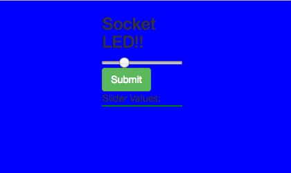

# [Socket LED](https://locallycontrolledsocketled.herokuapp.com/)
## April 27, 2017 (updated 6/4/2017 and 6/16/17)
### [David Eliason](http://www.deliason.com)
#### Controlling an arduino-controlled LED using node, johnny-five, Javascript, websockets, jQuery, express

**Instructions**

To have the joy of controlling a real-live rgb led, you can run this app locally:

1. clone repo
2. cd into repo
3. [cli] $ npm install
4. [cli] $ npm run start 
5. [browser] http://localhost:8000

**hardware side**
a. attach arduino to computer
b. spin up arduino ide
c. make sure board and port are configured properly
d. upload 'firmata' library to arduino
e. red = pin 9, green = 10, blue = 11

